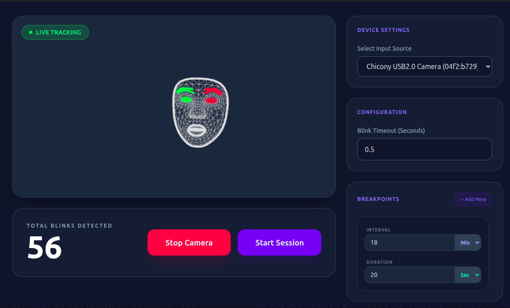

# Blinker

<p align="center">
  
</p>

<p align="center">
 
</p>

Too focused doing your job and forget to blink? that's bad for your eyes, fortunately this application just do the right thing for you.

## Screenshot




## Features

- Blink detector
- Camera selection
- Timeout customization
- Multiple breakpoints
- Breakpoint customization

## Developer Note

Devcontainer doesn't really work,
if you want to develop inside a container, you need to compile them everytime you want to see the change.

```bash
# Inside a devcontainer
npm run build:unpack
# Switch to your host terminal
./dist/linux-unpacked/blinker
```

```bash
# Or you could also try on browser, inside the devcontainer run this command: 
npm run dev -- --noSandbox
# Then go to your browser's http://localhost:5173
# Make sure you've forward the port 5173 in the devcontainer
```

## Project Setup

### Install

```bash
$ npm install
```

### Development

```bash
$ npm run dev
```

### Build

```bash
# For windows
$ npm run build:win

# For macOS
$ npm run build:mac

# For Linux
$ npm run build:linux
```
