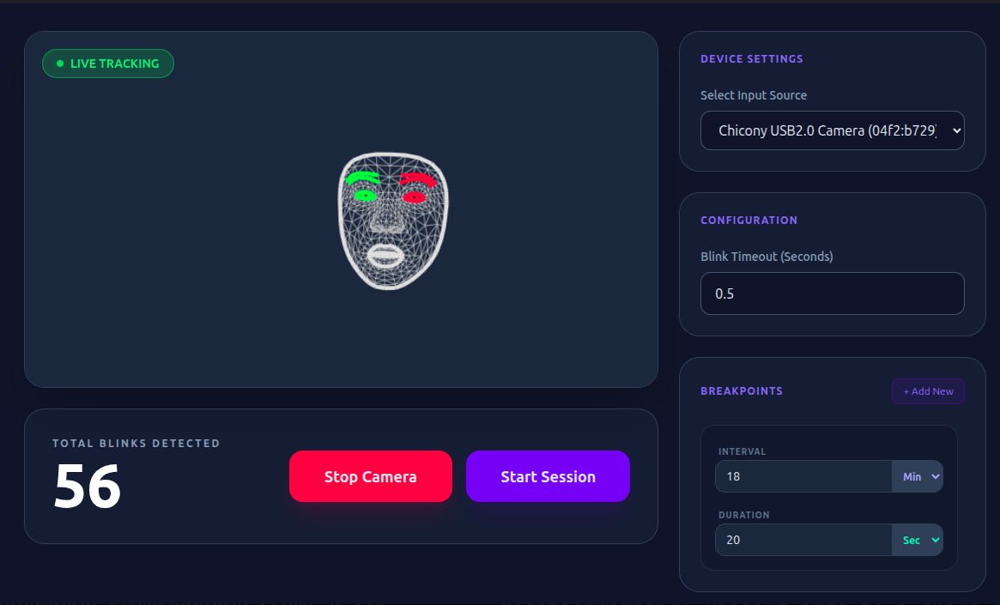

# Blinker

<p align="center">
  
</p>

<p align="center">
 
</p>

Too focused doing your job and forget to blink? that's bad for your eyes, fortunately this application just do the right thing for you.

## Screenshot




## Features

- Blink detector
- Camera selection
- Timeout customization
- Multiple breakpoints
- Breakpoint customization


## Todo 

- Fix full white box in the camera selection element and other.
- Use UI library like Shadcn/Radix for easy customize and mantain.
- If the user doesn’t have camera, it should have another method for reminding the user to blink, such as interval timer

## Downloads

### Binary (tar.xz / tar.gz) (soon)

### AppImage (soon)

### RPM/DEB package (soon)

### Flatpak (soon)

## Project Setup

### Install dependencies

Install Rust & Cargo
Install Node & Npm

Install Node dependencie:

```bash
$ npm ci
```

### Development

```bash
$ npm run dev
```

### Build

```bash 
npm ci
npm run tauri build
```

Build binary only

```bash
npm ci
npm run tauri build -- --no-bundle
```

Build flatpak and run flatpak (manually)

```bash
npm ci 
npm run tauri build -- --no-bundle
flatpak-builder --repo=repo --force-clean build-dir/ org.blinker.Blinker.yaml
flatpak --user install ./repo org.blinker.Blinker -y
flatpak run org.blinker.Blinker
```

## Developer Note

To automatically build the icons from a specific file:

```bash
npm run tauri icon app-icon.svg
```

## FAQ

### What’s the purpose?

This app is designed for people that looking at laptop or desktop for a long time, it help their eyes relax, and preventing or slowing the process of more nearsightedness. Blinking is good for eye’s health, but when we are too focus to do our jobs, we sometimes forget to blink, it sometimes also causes some headache if we’re focused for too long.

### Who are the targets?

Mainly for developers, but also for people that doing their job in front of computer.

### What are the platforms?

Mainly for desktop, it could be 

- Linux,
- Windows and
- macOS,

Again, I’m trying to help people that has the same problem as many as possible.

### What would the final product be?

Free to use for everyone and open source, transparent, and any developers could contribute for the project.
